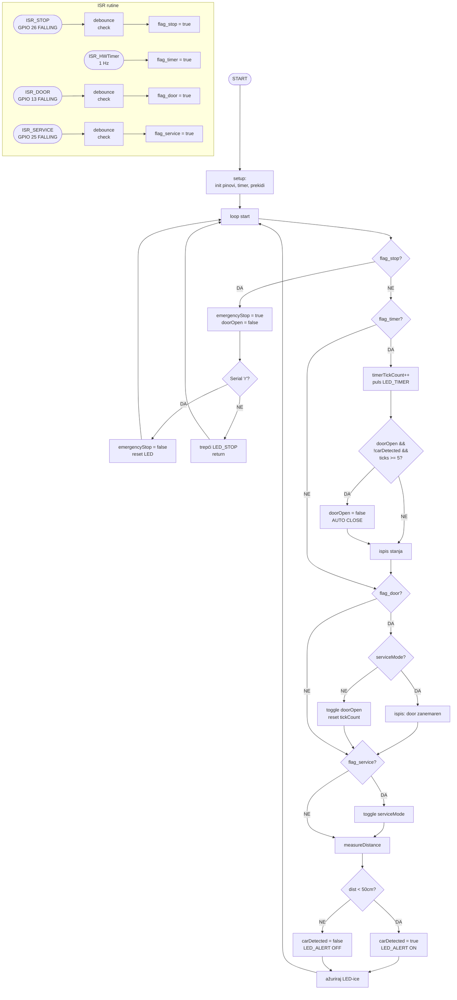

@mainpage RUS Lab1

# Smart Garage System – ESP32

Projekt demonstrira upravljanje višestrukim prekidima i njihovim prioritetima na ESP32 mikrokontroleru. Sustav simulira pametnu garažu s automatskim zatvaranjem vrata, detekcijom vozila i mogućnošću servisnog moda.

Razvoj i testiranje provedeni su u [Wokwi simulatoru](https://wokwi.com).

---

## Sadržaj

- [Opis sustava](#opis-sustava)
- [Korištene komponente](#korištene-komponente)
- [Shema spajanja](#shema-spajanja)
- [Prioriteti prekida](#prioriteti-prekida)
- [Opis prekida i ISR funkcija](#opis-prekida-i-isr-funkcija)
- [Zaštita resursa](#zaštita-resursa)
- [Control Flow Graph (CFG)](#control-flow-graph-cfg)
- [Testiranje](#testiranje)
- [Pokretanje projekta](#pokretanje-projekta)

---

## Opis sustava

Sustav upravlja garažnim vratima putem tipkala, senzora udaljenosti i hardware timera. Svaki izvor događaja obrađuje se kao prekid s definiranim prioritetom. Viši prioritet uvijek ima prednost pri obradi.

**Funkcionalnosti:**
- Otvaranje i zatvaranje vrata tipkalom
- Automatsko zatvaranje vrata nakon 5 sekundi ako nema vozila ispred
- Detekcija vozila HC-SR04 senzorom (sprječava auto-zatvaranje)
- Emergency stop koji trenutno zaustavlja sve operacije
- Servis mod koji onemogućuje upravljanje vratima
- Hardware timer koji okida ISR svaku sekundu

---

## Korištene komponente

| Komponenta | Opis |
|---|---|
| ESP32 DevKit C v4 | Mikrokontroler |
| HC-SR04 | Ultrazvučni senzor udaljenosti |
| Tipkalo zeleno | Upravljanje vratima |
| Tipkalo crveno | Emergency stop |
| Tipkalo žuto | Servis mod |
| LED zelena | Status vrata (GPIO 18) |
| LED crvena | Emergency stop (GPIO 19) |
| LED žuta | Servis mod (GPIO 21) |
| LED narančasta | Detekcija auta (GPIO 22) |
| LED plava | Timer tik (GPIO 23) |

---

## Shema spajanja

| Komponenta | ESP32 pin |
|---|---|
| LED vrata | GPIO 18 |
| LED stop | GPIO 19 |
| LED servis | GPIO 21 |
| LED alert | GPIO 22 |
| LED timer | GPIO 23 |
| Tipka vrata | GPIO 13 |
| Tipka stop | GPIO 26 |
| Tipka servis | GPIO 25 |
| HC-SR04 TRIG | GPIO 4 |
| HC-SR04 ECHO | GPIO 16 |

> **Napomena:** GPIO 26 korišten je za STOP tipku umjesto GPIO 33 jer su GPIO 33–39 input-only pinovi bez internog pull-up otpornika. GPIO 16 korišten je za ECHO umjesto GPIO 5 koji je strapping pin.

---

## Prioriteti prekida

Prioriteti su definirani redoslijedom provjere zastavica u `loop()` funkciji. ESP32 ne podržava klasične nested interrupts na razini hardvera kao ARM Cortex-M, već koristi FreeRTOS task prioritete. Softverski prioritet postignut je redoslijedom obrade zastavica.

| Prioritet | Izvor | GPIO | Tip | Opis |
|---|---|---|---|---|
| P1 – najviši | STOP tipka | 26 | Vanjski prekid (FALLING) | Emergency stop, zaustavlja sve |
| P2 | Hardware Timer | — | Timer ISR (1 Hz) | Periodička logika, auto-close |
| P3 | DOOR tipka | 13 | Vanjski prekid (FALLING) | Toggle vrata |
| P4 | SERVICE tipka | 25 | Vanjski prekid (FALLING) | Toggle servis mod |
| P5 – najniži | HC-SR04 senzor | 4 / 16 | Polling u loop() | Detekcija vozila |

---

## Opis prekida i ISR funkcija

### ISR_STOP — P1 (najviši prioritet)
Okida se na FALLING brid GPIO 26. Postavlja `flag_stop = true`. U `loop()` se obrađuje prva — odmah zatvara vrata i blokira sve ostale operacije dok se ne pošalje `r` kroz Serial Monitor.

### ISR_HWTimer — P2
Hardware timer okida ISR svaku sekundu precizno. Postavlja `flag_timer = true`. Nema debounce logike jer je timer stabilan izvor bez šuma. Koristi se za auto-zatvaranje vrata i periodički ispis stanja.

### ISR_DOOR — P3
Okida se na FALLING brid GPIO 13. Postavlja `flag_door = true`. Ignorira se ako je servis mod aktivan. Debounce prag je 200 ms.

### ISR_SERVICE — P4
Okida se na FALLING brid GPIO 25. Postavlja `flag_service = true`. Uključuje ili isključuje servis mod. Debounce prag je 200 ms.

### HC-SR04 senzor — P5 (najniži prioritet)
Nije prekid već polling unutar `loop()`. Mjeri udaljenost svaki prolaz petlje. Ako je udaljenost manja od 50 cm, auto zatvaranje se suspendira.

---

## Zaštita resursa

Dijeljene varijable između ISR funkcija i `loop()` zaštićene su na dva načina:

**Volatile zastavice** — sve zastavice (`flag_stop`, `flag_door`, `flag_service`, `flag_timer`) deklarirane su kao `volatile` što sprječava optimizaciju od strane kompajlera.

**Kritične sekcije** — svaki pristup zastavicama zaštićen je mutexom:
- U ISR funkcijama: `portENTER_CRITICAL_ISR(&mux)` / `portEXIT_CRITICAL_ISR(&mux)`
- U `loop()`: `portENTER_CRITICAL(&mux)` / `portEXIT_CRITICAL(&mux)`

Ovo sprječava race condition u slučaju da ISR prekine `loop()` točno u trenutku čitanja zastavice.

---

## Control Flow Graph (CFG)

Dijagram prikazuje tok izvršavanja glavnog programa i skokove u ISR rutine.

---

## Testiranje

| Test | Akcija | Očekivani rezultat |
|---|---|---|
| T1 | Pritisni zelenu tipku | Serial: `[P3] VRATA: OTVORENA` / `ZATVORENA` |
| T2 | Pritisni crvenu tipku | Serial: `[P1] EMERGENCY STOP AKTIVIRAN` |
| T3 | Upiši `r` u Serial Monitor | Serial: `[P1] RESET`, sustav nastavlja rad |
| T4 | Pritisni žutu tipku | Serial: `[P4] SERVIS MOD: UKLJUCEN` |
| T5 | Pritisni zelenu dok je servis aktivan | Serial: `[P3] DOOR zanemaren` |
| T6 | Otvori vrata, čekaj 5s bez auta | Serial: `[P2] AUTO CLOSE` |
| T7 | Otvori vrata, postavi senzor < 50cm | Auto-close se ne dogodi |
| T8 | Pritisni STOP dok su vrata otvorena | Vrata se odmah zatvaraju |

---

## Pokretanje projekta

### Wokwi simulator

https://wokwi.com/projects/459217890839149569

---

## Dokumentacija

Tehnička dokumentacija generirana je automatski pomoću Doxygena i dostupna je na GitHub Pages:

`https://borna-rus.github.io/RUS--Safar/`
