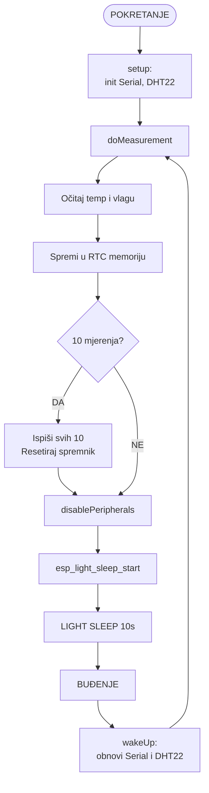

# ESP32 Datalogger – Upravljanje potrošnjom energije

Projekt demonstrira upravljanje potrošnjom energije na ESP32 mikrokontroleru
korištenjem Light Sleep režima mirovanja. Sustav periodički mjeri temperaturu
i vlagu putem DHT22 senzora, sprema zadnjih 10 mjerenja u RTC memoriju i
ulazi u Light Sleep između mjerenja.

Razvoj i testiranje provedeni su u [Wokwi simulatoru](https://wokwi.com/projects/463647009605644289).

---

## Sadržaj

- [Opis sustava](#opis-sustava)
- [Korištene komponente](#korištene-komponente)
- [Shema spajanja](#shema-spajanja)
- [Režimi mirovanja](#režimi-mirovanja)
- [Opis implementacije](#opis-implementacije)
- [Dijagram stanja](#dijagram-stanja)
- [Ograničenja simulacije](#ograničenja-simulacije)
- [Zaključak](#zaključak)

---

## Opis sustava

Sustav implementira periodičko buđenje (Varijanta B – Datalogger okoliša).
ESP32 se budi svakih 10 sekundi putem timer wake-up mehanizma, očitava
temperaturu i vlagu s DHT22 senzora te sprema vrijednosti u RTC memoriju.
Nakon 10 mjerenja ispisuje sve podatke i resetira spremnik.

**Funkcionalnosti:**
- Periodičko mjerenje temperature i vlage (svakih 10 sekundi)
- Spremanje zadnjih 10 mjerenja u RTC memoriju (`RTC_DATA_ATTR`)
- Ispis svih mjerenja nakon popunjenog spremnika
- Gašenje periferija prije ulaska u sleep
- Obnavljanje modula nakon buđenja

---

## Korištene komponente

| Komponenta | Opis |
|---|---|
| ESP32 DevKit C v4 | Mikrokontroler |
| DHT22 | Senzor temperature i vlage |

---

## Shema spajanja

| DHT22 pin | ESP32 pin |
|---|---|
| VCC | 3V3 |
| SDA | GPIO 4 |
| NC | – |
| GND | GND |

---

## Režimi mirovanja

| Režim | Korišten | Opis |
|---|---|---|
| Light Sleep | ✅ | CPU pauziran, RAM i RTC memorija sačuvani |
| Deep Sleep | ❌ | Nije podržan ispravno u Wokwi simulatoru |
| Hibernation | ❌ | Nije potrebno za ovaj zadatak |

### Usporedba modova

| Stavka | Light Sleep | Deep Sleep | Hibernation |
|---|---|---|---|
| RAM sačuvan | ✅ | ❌ | ❌ |
| RTC memorija | ✅ | ✅ | ✅ |
| Vrijeme buđenja | ~1 ms | ~10 ms | ~10 ms |
| Potrošnja | Niska | Vrlo niska | Najniža |

---

## Opis implementacije

### Faze rada sustava

**Aktivna faza** – očitavanje DHT22 senzora i spremanje u RTC memoriju

**Ulazak u sleep:**
- Gašenje periferija (`disablePeripherals()`)
- Postavljanje timer wake-up (`esp_sleep_enable_timer_wakeup()`)
- Pokretanje Light Sleep (`esp_light_sleep_start()`)

**Nakon buđenja:**
- Obnavljanje Serial komunikacije
- Reinicijalizacija DHT22 senzora
- Nastavak izvršavanja

### Čuvanje stanja
Koristi se `RTC_DATA_ATTR` za varijable koje moraju preživjeti sleep:
- `measurementCount` – broj trenutnih mjerenja u spremniku
- `totalWakeups` – ukupan broj buđenja od pokretanja
- `temperatures[]` – polje spremljenih temperatura
- `humidities[]` – polje spremljenih vlažnosti

---

## Dijagram stanja

---

## Ograničenja simulacije

- Wokwi ne simulira stvarnu potrošnju energije
- Deep Sleep nije ispravno podržan u Wokwi (watchdog reset umjesto timer wake-up)
- DHT22 vrijednosti su nasumično generirane u simulatoru
- Za stvarnu analizu potrošnje potrebna je hardverska platforma

---

## Zaključak

Implementacija prikazuje logiku upravljanja energijom, ali ne omogućuje
stvarnu procjenu potrošnje energije. Wokwi simulator omogućuje testiranje
logike sleep/wake ciklusa, ali za stvarnu analizu preporučuje se rad na
hardverskoj platformi s odgovarajućim mjeračima energije.
